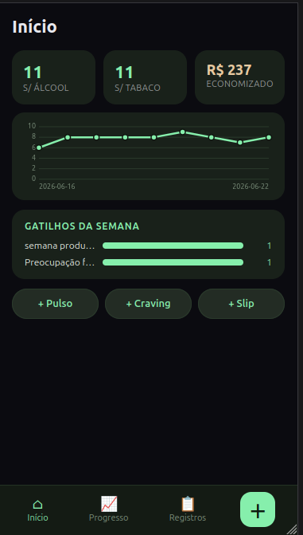
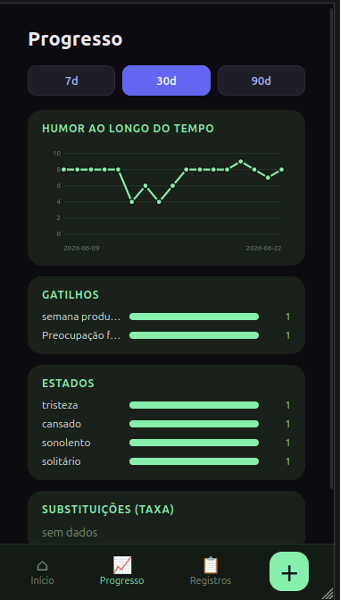
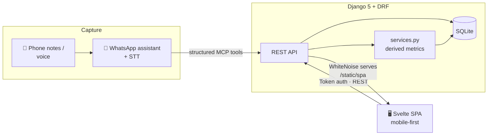

# Rumo ao Zero · *Toward Zero*

> A privacy-first, evidence-based companion for quitting tobacco and alcohol — where a relapse is **data, not failure**.

[](https://www.djangoproject.com/)
[](https://svelte.dev/)
[](https://vitejs.dev/)
[](https://github.com/astral-sh/uv)
[](https://cloud.google.com/run)
[](#testing)

**Rumo ao Zero** turns a behavior-change protocol into software. Instead of journaling in
scattered notes, every check-in, craving, and slip becomes a structured event — and the app
derives the things that actually keep you going: streaks, money saved, and *which coping
strategies measurably work for you*.

It started as a personal tool that replaced an Obsidian setup, and grew into a full-stack
product: a Django REST API, a mobile-first Svelte SPA, and an AI ingestion layer that lets me
log a craving by simply talking to a WhatsApp assistant.

<p align="center">
  
  &nbsp;&nbsp;
  
</p>
<p align="center">
  <sub><b>Início</b> — streaks, money saved, the day's mood curve and one-tap capture · <b>Progresso</b> — mood over time, triggers, internal states & substitution effectiveness</sub>
</p>

---

## Table of contents

- [Why it exists](#why-it-exists)
- [The science behind the data model](#the-science-behind-the-data-model)
- [Features](#features)
- [Architecture](#architecture)
- [Tech stack](#tech-stack)
- [Getting started](#getting-started)
- [API at a glance](#api-at-a-glance)
- [AI-assisted logging](#ai-assisted-logging)
- [Engineering decisions worth a look](#engineering-decisions-worth-a-look)
- [Testing](#testing)
- [Deployment](#deployment)
- [Project structure](#project-structure)

---

## Why it exists

Most quit-tracking apps reduce recovery to a counter that **resets to zero the moment you
slip** — which is exactly the shame spiral that drives the next relapse. Rumo ao Zero is built
on the opposite premise, drawn from relapse-prevention research:

> A slip is recorded as a **fact**, without judgment. It costs you that single day in the
> cumulative count — it never wipes the progress you earned.

Everything else follows from that stance: low-friction capture, metrics derived from raw
events (so they can never lie), and a feedback loop that surfaces *what is actually helping*.

## The science behind the data model

The schema is a direct encoding of established behavior-change frameworks — the data model
*is* the protocol:

| Concept in the app | Backing framework |
|---|---|
| **Internal states** (hunger, anger, loneliness, fatigue + your own) preceding a craving | HALT, made into an extensible catalog |
| **If-Then plans** — "IF *trigger* THEN *action*" | Implementation Intentions (Gollwitzer) |
| **Craving thought records** (automatic thought → evidence for/against → balanced thought) | CBT 7-column thought record |
| **Day-0 baseline** with an anchor letter to your future self in crisis | Commitment & motivational interviewing (DARN) |
| **Pennebaker writing** across the first four days | Expressive-writing protocol |
| **Hierarchy of Values** — 5 core values and how use erodes them | Values-based motivation (ACT) |
| **Substitution taxonomy** — 5 fixed coping-response categories, ranked by *measured* effectiveness | Competing-response training |
| **Craving/slip trigger** — a fixed taxonomy of 18 situations across 8 clinical categories | Marlatt & Gordon's relapse taxonomy (1985), operationalized by Annis' IDS/ISS |

The trigger taxonomy deserves its own note: it's the one place the schema deliberately does
*not* let the user free-type. Marlatt & Gordon's eight relapse-determinant categories were
operationalized by Annis into the IDS (alcohol) and ISS (smoking) inventories — the same eight
factors cover both substances, which is exactly this project's case (quitting both at once). A
mutable trigger catalog sounds more flexible, but it silently answers the app's central question
— *what's my worst trigger?* — with a lie: "End of workday" and "end of workday" (typed once
each) become two separate bars, each under-counted. Fixing the taxonomy in code, with the
category derived from the situation and never stored, means the count can't drift.

## Features

- 📔 **Daily entry** — a 2-minute end-of-day reflection: mood, energy, sleep, craving peak,
  internal states, substitutions used, and a few lines of prose.
- 💓 **Pulses** — lightweight intra-day mood/energy check-ins, so you can see the *curve* of a
  day and correlate craving spikes with mood dips.
- 🌊 **Craving events** — capture intensity, time-to-calm, the trigger, the CBT thought record,
  and which substitution you reached for.
- 📊 **Derived dashboard** — consecutive & cumulative streaks (per substance), money saved,
  most frequent triggers/states, and substitution effectiveness ranked by real resolution rate.
- 🗂️ **Project backlog as data** — items, ADR-style decisions, medical consultations, and
  purchases, all queryable instead of buried in notes.
- 📱 **Mobile-first SPA** — a calm dark "sage" theme, bottom navigation, and a one-tap capture
  sheet, all served straight from Django.

## Architecture



Three cooperating layers:

1. **Django + DRF backend** — four domain apps (`baseline`, `log`, `backlog`, `accounts`),
   token-authenticated, single-user today but modeled per-user from day one. Metrics live in a
   pure `services.py` and are computed from events, never from denormalized columns.
2. **Svelte 5 SPA** — TypeScript, Vite, design tokens, and small hand-rolled charts. The
   production build is collected by `collectstatic` and served by WhiteNoise at `/static/spa/`,
   so the whole product ships as a single Django process.
3. **AI ingestion** — an MCP server (`rumo-registro`) exposes log/query/edit tools so an agent
   can record events over WhatsApp *without shell access*, plus a CLI for manual entry.

## Tech stack

**Backend** — Django 5 · Django REST Framework · django-filter · drf-spectacular (OpenAPI/Swagger) · SQLite · Gunicorn · WhiteNoise · [uv](https://github.com/astral-sh/uv)
**Frontend** — Svelte 5 · TypeScript · Vite 8 · Vitest · Testing Library
**Tooling & infra** — pytest + pytest-django · factory-boy · Docker · Google Cloud Run · MCP (Model Context Protocol)

## Getting started

### Backend

```bash
cd apps/backend
uv run python manage.py migrate
uv run python manage.py createsuperuser   # first run only
uv run python manage.py runserver
```

- Admin → http://127.0.0.1:8000/admin/
- Browsable API → http://127.0.0.1:8000/api/
- Swagger docs → http://127.0.0.1:8000/api/docs/

### Frontend

```bash
cd apps/backend/frontend
npm install
npm run dev        # Vite dev server with HMR
npm run build      # production build → frontend/dist (served by Django)
```

## API at a glance

Authenticate once, then POST events — the `user` is always inferred from the token, never sent
in the payload.

```bash
# 1. get a token
curl -s -X POST http://127.0.0.1:8000/api/auth/token/ \
  -d "username=USER&password=PASS"            # -> {"token": "..."}

# 2. log a daily entry
curl -s -X POST http://127.0.0.1:8000/api/log/daily/ \
  -H "Authorization: Token YOUR_TOKEN" -H "Content-Type: application/json" \
  -d '{"data":"2026-05-25","humor":3,"energia":4,"sono_h":"7.0","sono_q":4,"craving_pico":2}'
```

| Resource | Route |
|---|---|
| Daily entries / Pulses | `/api/log/daily/` · `/api/log/pulsos/` |
| Cravings / Slips | `/api/log/cravings/` · `/api/log/slips/` |
| Baseline (Day 0) | `/api/baseline/profile/` |
| Values · If-Then | `/api/baseline/{values,ifthen}/` |
| Trigger / internal-state / substitution taxonomy (fixed, read-only) | `/api/taxonomia/{gatilhos,estados,substituicoes}/` |
| Backlog · Decisions · Consultations · Purchases | `/api/backlog/{items,decisions,consultas,compras}/` |
| Derived dashboard / Mood series | `/api/dashboard/` · `/api/series/humor/` |

Every list endpoint supports filtering, e.g. `/api/backlog/items/?secao=saude&status=pendente`.

## AI-assisted logging

The friction killer. Capture a craving on your phone (notes or voice), and an assistant turns
it into authenticated API calls. The `rumo-registro` **MCP server** wraps the same core logic
as the CLI and exposes it as structured tools, so a messaging-profile agent can log, query, and
edit entries safely — no shell, no raw SQL. Audio is transcribed locally (faster-whisper) with
an OpenAI fallback.

## Engineering decisions worth a look

- **Metrics are derived, never stored.** Streaks, money saved, and substitution effectiveness
  are computed from raw `CravingEvent`/`Slip` rows in `services.py`, so they can never drift out
  of sync with reality.
- **Timezone-correct streaks.** Event timestamps are UTC-aware and converted to local time
  before extracting a date — avoiding the classic off-by-one bug near midnight.
- **A slip resets nothing.** The "slip is data" principle is enforced in the streak math, not
  just documented.
- **Validated subjective scales.** 1–5 and 0–10 ranges are validated at the model layer, not
  left to convention.
- **Single deployable.** The SPA build is served by the same Django process via WhiteNoise — one
  container, one thing to deploy.
- **Portable persistence.** SQLite lives on a mounted volume via `DB_PATH`; swapping databases
  means changing one env var, not the app.

## Testing

```bash
cd apps/backend && uv run pytest          # API, services & metrics
cd apps/backend/frontend && npm test      # Svelte components (Vitest)
```

Coverage focuses on the load-bearing logic: derived metrics, streak edge cases (pre-Day-0,
slip handling), API auth/ownership, and the capture flow.

## Deployment

A multi-stage-friendly `Dockerfile` produces a Cloud Run–ready image: `uv sync --frozen`,
`collectstatic`, then Gunicorn behind `$PORT`. The entrypoint runs migrations on boot and SQLite
persists on a mounted `/data` volume. See [`apps/backend/deploy/`](apps/backend/deploy/) for the
systemd unit and entrypoint used on the self-hosted production box.

## Project structure

```
rumo_ao_zero/
├── apps/backend/
│   ├── apps/
│   │   ├── accounts/      # custom user (multi-user ready)
│   │   ├── baseline/      # Day-0 snapshot + libraries (values, if-then) + fixed taxonomies (triggers, states, substitutions)
│   │   ├── log/           # daily entries, pulses, cravings, slips + derived metrics
│   │   └── backlog/       # project items, decisions (ADR), consultations, purchases
│   ├── config/            # settings, urls, SPA view
│   ├── frontend/          # Svelte 5 + TS + Vite SPA
│   ├── scripts/           # CLI + MCP server for AI ingestion
│   ├── deploy/            # Cloud Run entrypoint + systemd unit
│   └── Dockerfile
├── docs/                  # specs & design reports
└── scripts/               # DB sync / backup helpers
```

---

<sub>A personal project, built in the open as part of my portfolio. The domain is in pt-BR
(the app's UI language); this README is in English for a wider audience.</sub>
